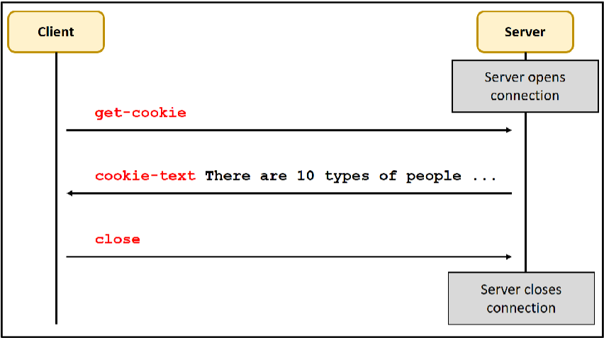

# Objective
The objective of this workshop is to write a client/server fortune cookie
## Setup
a. Create a repository in Github
b. Clone the repository
## Workshop
### Task 1
Write a fortune cookie server that will serve random cookie. The server is
started as follows
`java -cp fortunecookie.jar fc.Server 12345 cookie_file.txt`
This will start the server; the server will now listen on port `12345` (TCP).
`cookie_file.txt` is a file containing a list of ‘cookies’. This is a text file. The server
will randomly return one cookie from this file.
### Task 2
Write a separate class, `Cookie`, to manage the cookie file. All interactions
with cookie should go through an instance of this class. Examples of interaction
include open and closing the cookie file and randomly return a cookie text.
### Task 3
Write a fortune cookie client what will make a request to a fortune cookie
server to get a cookie. The client is started as follows
`java -cp fortunecookie.jar fc.Client locahost:12345`
The server for the client to connect to is in the form of <host>:<port>.
The client will request a cookie from the server, displays the cookie and closes
the connection.

### Task 4
The communication between the client and the server is shown in the
following diagram

The above diagram shows the interaction between the client and the server.
After the client connects to the server the client will send a get-cookie
command to the server.
When the server receives the get-cookie, it will randomly select a cookie
text from the cookie file. The cookie text will then be send back to the client.
The cookie text will be prefixed with the command cookie-text.
Once the client receives the cookie-text command, the client will strip the
cookie-text prefix and displays the cookie in the console.
The client can optionally get more cookies (by sending get-cookie
command) or closes the connection with a close command.
Command summary
• `get-cookie` - send by client to server; request the server to send a
cookie
• `cookie-text` - send by server to client in respond to a get-cookie.
cookie-text is used to return a cookie to a client. The cookie text comes
after the cookie-text command
• `close` - send by client to server; request the server to close the connection

## Submission
When you have completed your program, commit and push the master branch
to the remote repository.
